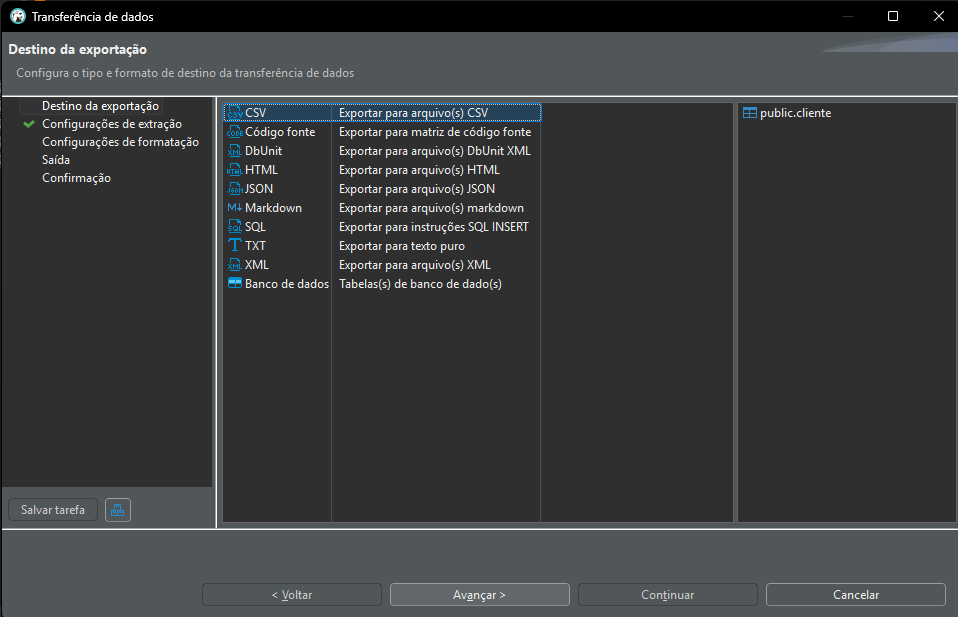
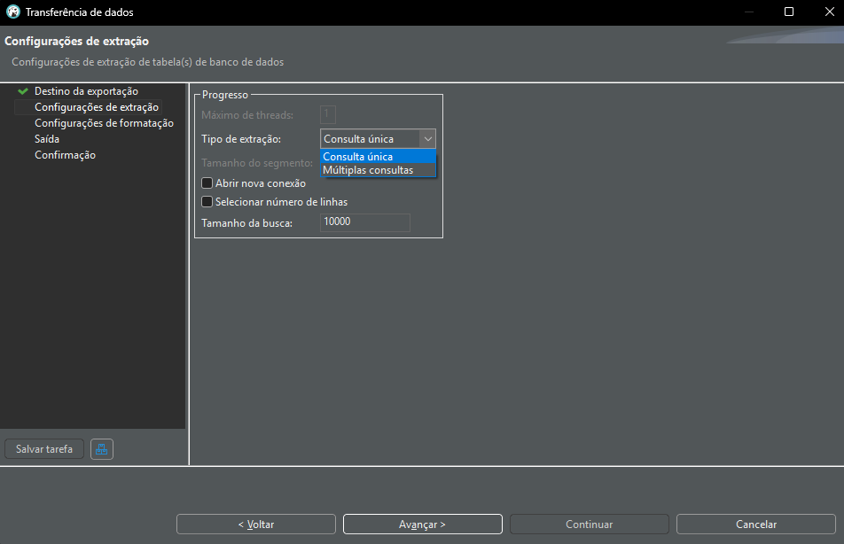
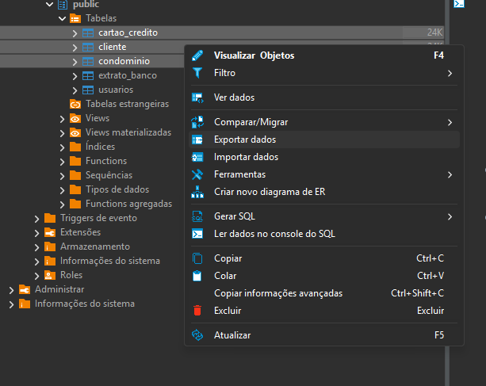
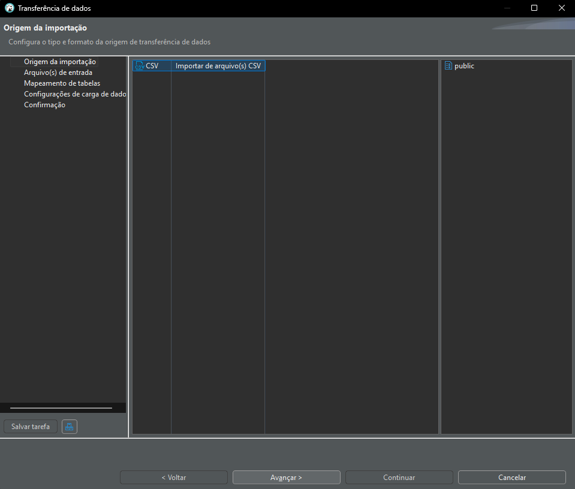
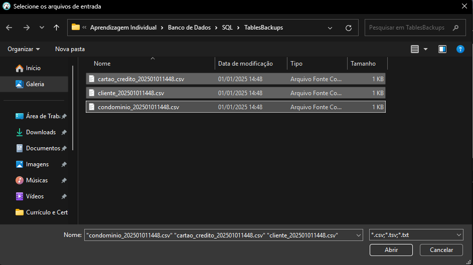

# Tutorial Parte I - Entendendo as Nomenclaturas Iniciais

Neste tutorial, vamos entender as nomenclaturas e conceitos básicos relacionados a banco de dados, postgreSQL e operações comuns em um banco relacional.

### O que é uma **query**?

Uma **query** é uma requisição feita ao banco de dados, geralmente utilizando a linguagem SQL (Structured Query Language). Ela serve para interagir com o banco de dados, seja para buscar dados, modificar informações, inserir ou deletar registros.

#### Tipos de Queries Comuns:
- **SELECT**: Utilizado para consultar ou buscar dados de uma tabela.
- **INSERT**: Usado para adicionar novos registros em uma tabela.
- **UPDATE**: Para modificar dados já existentes em uma tabela.
- **DELETE**: Para remover dados de uma tabela.

### O que é uma **tabela**?

Uma **tabela** é uma estrutura de dados que organiza informações em linhas (também chamadas de registros ou "tuplas") e colunas (chamadas de campos ou atributos). Cada coluna tem um nome e um tipo de dado específico, e cada linha contém um conjunto de dados relacionados.

### O que é uma **coluna**?

Uma **coluna** é um campo de uma tabela, onde os dados são armazenados. Cada coluna tem um nome e um tipo de dado (como `VARCHAR`, `INT`, `DATE`, entre outros) que define o tipo de informações que ela pode armazenar. Por exemplo, uma tabela de usuários pode ter colunas como `id`, `nome`, `email`.

### O que é um **registro**?

Um **registro** (ou **linha**) é um conjunto de dados correspondentes aos campos de uma tabela. Cada linha contém valores para cada coluna. Por exemplo, em uma tabela de usuários, um registro pode conter o nome, e-mail e ID de um usuário específico.

### O que é uma **chave primária (PRIMARY KEY)**?

A **chave primária** é uma coluna (ou conjunto de colunas) que identifica de forma única cada registro em uma tabela. Nenhum valor na chave primária pode ser nulo e deve ser único em cada linha da tabela.

### O que é uma **chave estrangeira (FOREIGN KEY)**?

Uma **chave estrangeira** é uma coluna em uma tabela que faz referência à chave primária de outra tabela. Ela é usada para estabelecer relacionamentos entre duas tabelas, permitindo que as informações sejam associadas de maneira eficiente.

Exemplo:
- Em uma tabela de **usuários**, a chave estrangeira pode ser `condominio_id`, que faz referência à tabela `condominio` e liga um usuário a um condomínio específico. (Presente no exemplo 1 dos scripts)

# Tutorial Parte II - Tipos de Dados

## Tipos de Dados em SQL

Ao criar tabelas em SQL, cada coluna precisa ter um tipo de dado definido. O tipo de dado determina o tipo de valores que aquela coluna pode armazenar, como texto, números ou datas.

## Principais Tipos de Dados

### 1. **Tipos Numéricos**
Usados para armazenar números inteiros ou decimais.

- **`INT`**: Armazena números inteiros. Exemplo: 1, 42, -100.  
  - **`SMALLINT`**: Para números inteiros menores (economiza espaço). Exemplo: 1, 255.
  - **`BIGINT`**: Para números inteiros grandes. Exemplo: 9.223.372.036.854.775.807.
- **`DECIMAL(p, s)` ou `NUMERIC(p, s)`**: Armazena números decimais com precisão definida.  
  - `p`: Total de dígitos.  
  - `s`: Quantidade de dígitos após o ponto decimal.  
  - Exemplo: `DECIMAL(10, 2)` armazena até 10 dígitos, sendo 2 após o ponto decimal (como `12345678.90`).
- **`FLOAT`** ou **`REAL`**: Para números com ponto flutuante (menos precisos que `DECIMAL`).

### 2. **Tipos de Texto**
Usados para armazenar strings (textos).

- **`CHAR(n)`**: Armazena strings de tamanho fixo. Exemplo: `CHAR(5)` sempre reserva 5 caracteres, mesmo que o valor seja menor.
- **`VARCHAR(n)`**: Armazena strings de tamanho variável até o limite especificado. Exemplo: `VARCHAR(100)` permite strings de até 100 caracteres.
- **`TEXT`**: Para armazenar textos longos sem limite especificado. Exemplo: Artigos ou descrições detalhadas.

### 3. **Tipos de Data e Hora**
Usados para armazenar informações temporais.

- **`DATE`**: Apenas a data (ano, mês, dia). Exemplo: `2024-12-30`.
- **`TIME`**: Apenas a hora (hora, minutos, segundos). Exemplo: `14:30:00`.
- **`TIMESTAMP`**: Combina data e hora. Exemplo: `2024-12-30 14:30:00`.
- **`INTERVAL`**: Armazena períodos de tempo (como "2 dias" ou "3 horas").

### 4. **Tipos Booleanos**
Armazena valores lógicos.

- **`BOOLEAN`**: Representa `TRUE`, `FALSE` ou `NULL`.

### 5. **Tipos Especiais**
Usados para casos mais específicos.

- **`SERIAL`**: Usado para criar identificadores únicos automaticamente. Geralmente usado para chaves primárias. Exemplo: `id SERIAL`.
- **`JSON`** ou **`JSONB`**: Para armazenar dados no formato JSON (útil em bancos modernos).
- **`ARRAY`**: Permite armazenar múltiplos valores em uma única coluna.

## Escolhendo o Tipo Certo

Escolher o tipo de dado correto é essencial para garantir que:
1. **Os valores armazenados estejam no formato correto.**
2. **O espaço de armazenamento seja utilizado de forma eficiente.**

Por exemplo:
- Para **idade**, use `SMALLINT` em vez de `INT`, pois o valor máximo será pequeno.
- Para **nomes**, use `VARCHAR(100)` ou `TEXT` dependendo da necessidade.
- Para valores monetários, `DECIMAL(10, 2)` é uma escolha ideal.

---

Com esses tipos de dados, você pode modelar tabelas de forma eficiente, garantindo consistência e desempenho no banco de dados.

# Tutorial Parte III - Criação e Relacionamento de Tabelas

```sql

-- criando  tabela novamente para reforçar

create table usuarios (
	id serial primary key,
	nome VARCHAR(100),
	email VARCHAR(100)
);

-- inserindo valores

insert into usuarios (nome, email)
values
('Igor Pereira', 'igor@gmail.com'),
('Mariana', 'mari@gmail.com');

--checando se está tudo certo

select * from usuarios;

--criando a tabela condominio para que eu possa relacionar

create table condominio (
	id serial primary key,
	nome VARCHAR(100),
	apartamento smallint,
	bloco smallint,
	alguel decimal(10,2)
);

--percebi o erro na escrita, mas agora aprendi a renomear

alter table condominio
rename alguel to aluguel;

--inseri valores dentro da tabela condominio

insert into condominio(nome, apartamento, bloco, aluguel)
values
('Igor Pereira', 12, 3, 1200.00),
('João Celestino', 15, 4, 1000.00);

--checando os dados

select * from condominio;

--agora eu estou fazendo a relação entre as tabelas, para começo
--adicionei uma nova coluna na tabela usuarios

alter table usuarios
add column condominio_id INT;

--em seguida estou definindo que essa coluna é uma chave estrangeira

alter table usuarios
add constraint condominio_id -- Cria chave estrangeira para relacionar a tabela usuarios com a tabela condominio
foreign key (condominio_id) references condominio(id) -- E essa é a coluna que vai referenciar as duas tabelas
on delete set null; -- se condominio for deletado o campo será null

--Vamos atualizar agora essas tabelas!

update usuarios u
set condominio_id = c.id
from condominio c
where u.condominio_id IS NULL
and c.nome = u.nome;

--Mas perceba que na linha 2 Mariana, a associação não está funcionando porque la em cima eu adicionei outro nome

select u.id as usuario_id, u.nome as usuario_nome, u.email as usuario_email, u.condominio_id, c.nome as condominio_nome
from usuarios u
left join condominio c on u.condominio_id = c.id;

--Ajustes

update condominio
set nome = 'Mariana'
where id = 6;
-- Como eu deletei algumas vezes, o id de condominio continuou subindo,
-- logo quando voltei a essa correção tive que mudar o número do id
--mas caso você esteja fazendo isso pela primeira vez então: where id = 2;

--Novamente

update usuarios u
set condominio_id = c.id
from condominio c
where u.condominio_id is null
and c.nome = u.nome;

-- Nesse select fiz alguns nomes temporarios para melhorar o entendimento
select u.id as usuario_id, u.nome as usuario_nome, u.email as usuario_email, u.condominio_id, c.nome as condominio_nome
from usuarios u
left join condominio c on u.condominio_id = c.id;

-- Apenas o usuarios que possuem um condominio_id dentro da tabela de usuarios
-- compatível com um condominio_id dentro da tabela condominio serão mostrados
select usuarios.nome, condominio.nome
from usuarios
inner join condominio on usuarios.condominio_id = condominio.id;

-- Serão mostrados todos os nomes da tabela da esquerda, mas a da direita os
-- que não estiverem de acordo com a condição será apresentado como NULL

select usuarios.nome, condominio.nome
from usuarios
left join condominio on usuarios.condominio_id = condominio.id;

-- Serão mostradas condominio.nome da tabela da direita, mas o que
-- não estiver associado na esquerda será demonstrado como NULL

select usuarios.nome, condominio.nome
from usuarios
right join condominio on usuarios.condominio_id = condominio.id;

--Todas as linhas serão mostradas independente da correspondencia

select usuarios.nome, condominio.nome
from usuarios
full join condominio on usuarios.condominio_id = condominio.id;

--Todos os usuarios serão combinados com todos os nomes de condominios
-- formando a todas as combinações possíveis, resumindo: é um produto cartesiano.

select usuarios.nome, condominio.nome
from usuarios
cross join condominio;

--Vamos adicionar alguns usuarios desconexos com condominios e virce-versa para entender melhor o JOIN

insert into condominio (nome,apartamento,bloco,aluguel)
values
('Lucas', 27, 6, 800.00);

insert into usuarios (nome,email)
values
('Natan', 'natanzinhogameplays@gmail.com');

--Conferindo

select * from usuarios;

select * from condominio;

-- Agora repita todos os comandos anteriores de Inner, Left, Right, Full e Cross. Agora você vai entender a diferença!
```
# Tutorial Parte IV - Funções básicas de Agregação e Trigger

```sql
-- Vamos criar um novo contexto com novas tabelas para aprender sobre funções básicas de agregação (count,sum,avg,max,min)

create table cliente (
	id serial primary key,
	nome VARCHAR(100) not null, --not null significa que essa coluna não pode conter valores nulos
	cpf VARCHAR(11) not null,
	email VARCHAR(255) not null
);

insert into cliente ( nome, cpf, email)
values
('Igor Pereira', '53004758075', 'shaolinmatadordeporco@hotwells.com'),
('Ivanilson', '72348676001', 'maxsteel@hotwells.com');

select * from cliente;

create table cartao_credito (
	id serial primary key,
	cliente_id int not null,
	numero_cartao VARCHAR(16) not null,
	limite decimal(10,2) not null,
	limite_disponivel decimal(10,2) not null,
	foreign key (cliente_id) references cliente(id) on delete cascade
);

alter table cartao_credito
add column data_validade DATE, --percebi que para ser realista faltou esses dois dados!!
add column cvv smallint;

-- Perceba que colocando o ID a gente é quem decide de quem é o cartão
insert into cartao_credito (cliente_id ,numero_cartao, limite, limite_disponivel, data_validade, cvv) 
values
(1,'5564959910010564', 1200.00, 1200.00, '2026-01-31', 381), --Perceba que eu coloquei YYYY/MM/DD quando pesquisei vi que esse era o formato de DATE
(2,'5138020755144971', 800.00, 800.00, '2026-07-01', 504);

select * from cartao_credito; -- Agora a gente tem um cliente e um cartão associado ao mesmo

-- Precisamos guardar os dados das compras na tabela extrato_banco 

create table extrato_banco (
	id serial primary key,
	cliente_id int not null, 
	cartao_id int not null,
	descricao_compra VARCHAR(255) not null,
	valor_compra decimal (10,2) not null,
	data_compra TIMESTAMP not null default current_timestamp,
	foreign key (cliente_id) references cliente(id) on delete cascade,
	foreign key (cartao_id) references cartao_credito(id) on delete cascade
);

select * from extrato_banco;

-- Acabei de notar que se eu quiser deixar isso bem realista vou ter que
-- fazer uma forma de debitar o limite quando o dado for inserido no extrato_banco

CREATE OR REPLACE FUNCTION debitar_limite()
RETURNS TRIGGER AS $$  -- Delimitador do corpo da função começa aqui
BEGIN
    -- Atualiza o limite disponível do cartão de crédito
    UPDATE cartao_credito
    --Você também percebeu que temos colunas de tabelas distintas aqui, isso ocorre porque ainda vamos
    --relacionar a tabela de ativação do trigger a tabela que possui a coluna limite_disponivel
    SET limite_disponivel = limite_disponivel - NEW.valor_compra 
    WHERE id = NEW.cartao_id;

    RETURN NEW; -- Retorna a linha modificada no trigger
END;
$$ LANGUAGE plpgsql; -- Delimitador termina aqui, plpgsql é a linguagem embutida no postgresql para usar um (for,if...)


CREATE TRIGGER after_insert_extrato
AFTER INSERT ON extrato_banco -- depois que acontecer o query insert no extrato_banco, vai ser um gatilho para ativar a função de cima e atualizar cartao_credito
FOR EACH row -- indica que sempre vai ser ativado quando você inserir uma linha
EXECUTE FUNCTION debitar_limite(); --indica a função que vai ser executada pelo gatilho

insert into extrato_banco(cliente_id, cartao_id, descricao_compra, valor_compra, data_compra)
values
(1,2,'Placa de vídeo 4060 TI do Falsificada', 500.00, '2024-12-31 23:59:59'),
(2,3,'Compra de RP no LoL', 200.00, '2024-12-31 20:00:59');

select * from extrato_banco;

select * from cartao_credito;

-- Agora vamos as funções de Agregação Básicas:

-- Primeiro vou fazer mais alguns gastos nas contas acima para as funções fazerem sentido.

insert into extrato_banco(cliente_id, cartao_id, descricao_compra, valor_compra, data_compra)
values
(1,2,'Lanchezinho da meia noite', 50.00, '2024-12-25 23:59:59'),
(2,3,'Lanchezinho da meia noite', 40.00, '2024-12-26 00:00:00'),
(1,2,'Sorvete', 10.00, '2024-12-22 15:59:59'),
(2,3,'Cervejinha', 30.00, '2024-12-19 19:00:00');

select c.nome,e.cliente_id, sum(valor_compra) as total_gasto -- Agora a gente sabe o total que cada um gastou
from extrato_banco e
join cliente c on e.cliente_id = c.id -- join sem especificação sempre é inner join!!
group by c.nome,cliente_id;

-- Vemos aqui que ivanilson é bem mais economico e mantém suas compras em uma média bem mais regular
select c.nome,e.cartao_id, avg(valor_compra) as media_compra 
from extrato_banco e
join cliente c on e.cliente_id = c.id --lembrando que esse "on" é como se fosse um "quando", então quando e.cliente_id = c.id, mostre o resultado da seleção
group by c.nome,cartao_id;

-- Vamos contar quantas compras foram feitas

select c.nome,e.cliente_id, count(*) as numero_compra
from extrato_banco e
join cliente c on e.cliente_id = c.id
group by c.nome,cliente_id;

-- Digamos que queremos ver qual foi o maior e o menor gasto do mês

select c.nome ,e.cliente_id, max(valor_compra) as maior_compra, min(valor_compra) as menor_compra
from extrato_banco e
join cliente c on e.cliente_id = c.id
group by c.nome,cliente_id;

-- Lembrando que se você quiser ver só o ID sem o nome, retira o join,
-- retira o c.nome do group by e retira os "alises" ,ou seja, as abreviações

-- Vamos fazer alguns filtros nessas buscas!!!

select c.nome, e.cliente_id, sum(valor_compra) as total_gasto
from extrato_banco e
join cliente c on e.cliente_id = c.id
where valor_compra >= 100 -- o where está limitando a soma apenas a valores iguais ou acima de 100 reais, talvez isso seja mais interessante no min e max
group by c.nome,e.cliente_id;

-- Vamos testar o min e max

select c.nome, e.cliente_id,max(valor_compra) as maior_compra
from extrato_banco e
join cliente c on e.cliente_id = c.id
where valor_compra >=150
group by c.nome, e.cliente_id;

select c.nome, e.cliente_id, min(valor_compra) as menor_compra -- A cerveja as vezes sai caro...
from extrato_banco e
join cliente c on e.cliente_id = c.id 
where valor_compra <= 100
group by c.nome, e.cliente_id;

-- o que acontece se a gente não usar o group by ?

-- surgiu um valor de 830, pesquisei no GPT ele disse que é a soma de todas as linhas é interessante saber..
select sum(valor_compra) as total_compra 
from extrato_banco;

```
# Tutorial Parte V - Como realizar backup

```sql

-- Vamos começar com um full backup

-- Você vai colocar isso no terminal
-- pg_dump -U igor -d aprendendo -F c -b -v -f "C:/Users/igorp/OneDrive/Desktop/Meus Estudos/Aprendizagem Individual/Banco de Dados/SQL/Backup/primeirobackup.dump"

-- Se você não sabe o nome do usuario

SELECT current_user;

--lembrando que esse backup é feito no terminal, não precisa entrar no banco pelo psql.


--Vamos aprender a Importar e Exportar Tabelas

-- 1ª Forma é via query

-- Exportação:

COPY cliente TO 'C:/Users/igorp/OneDrive/Desktop/Meus Estudos/Aprendizagem Individual/Banco de Dados/SQL/TablesBackups/clientes_export.csv' DELIMITER ',' CSV HEADER;

-- Se vocês se recordam eu tenho uma tabela chamada cliente, ela tem 4 colunas, id,cpf,nome,email.
-- Defini um caminho para uma pasta, delimitei que o que está separando os dados é uma virgula
-- e o formato é CSV, mas poderia ser também JSON,SQL ou Excel.

--Porém vai dar permissão negada, tentei acessar pelo windows+R o Services.msc e mudar o usuario logon do serviço postgresql17
--Mas não recomendo vai rodar muito e chegar a nada, procurei em fóruns e vi alguns profissionais falarem que é melhor usar
--Import e export do pgAdmin ou apenas usar aqui do Dbeaver mesmo. (Estou falando isso mais a título de informação)


-- 2ª Forma via Dbeaver
```
# Configurações de Extração no DBeaver (Escolhas Cruciais)

## Como começar:


## Formatos:


## Formatos de Exportação no DBeaver

### 1. **CSV (Comma-Separated Values)**
- **Descrição:** Arquivo de texto onde os valores são separados por vírgulas (ou outro delimitador, como ponto-e-vírgula).
- **Compatibilidade:** Suportado amplamente por ferramentas como Microsoft Excel, Google Sheets, LibreOffice Calc e bases de dados.
- **Vantagens:**
  - Simples e leve.
  - Ideal para transferir dados entre sistemas ou abrir em planilhas.
- **Desvantagens:**
  - Não suporta formatação avançada (cores, fórmulas, etc.).
  - Pode ter problemas com caracteres especiais se a codificação não for configurada corretamente.

---

### 2. **XLSX (Excel)**
- **Descrição:** Formato nativo do Microsoft Excel.
- **Compatibilidade:** Abrível diretamente no Excel, Google Sheets e LibreOffice Calc.
- **Vantagens:**
  - Suporta formatação avançada, fórmulas e gráficos.
  - Ideal para relatórios que precisam de uma apresentação profissional.
- **Desvantagens:**
  - Arquivo mais pesado em comparação ao CSV.
  - Pode ter problemas de compatibilidade com versões muito antigas do Excel.

---

### 3. **JSON (JavaScript Object Notation)**
- **Descrição:** Formato leve e estruturado usado para troca de dados.
- **Compatibilidade:** Suportado por linguagens de programação, APIs e sistemas web.
- **Vantagens:**
  - Estruturado e fácil de interpretar por sistemas automáticos.
  - Ideal para integrar dados em aplicações ou APIs.
- **Desvantagens:**
  - Não é amigável para visualização humana.
  - Não adequado para uso direto em planilhas.

---

### 4. **XML (eXtensible Markup Language)**
- **Descrição:** Formato estruturado baseado em tags, semelhante ao HTML.
- **Compatibilidade:** Suportado por bancos de dados, linguagens de programação e ferramentas específicas.
- **Vantagens:**
  - Altamente estruturado e flexível.
  - Bom para integrar dados em sistemas complexos.
- **Desvantagens:**
  - Arquivo geralmente mais pesado.
  - Menos intuitivo para leitura humana em comparação ao JSON.

---

### 5. **SQL**
- **Descrição:** Exporta os dados como comandos SQL (INSERT), permitindo recriar os registros em outro banco.
- **Compatibilidade:** Suportado por sistemas de banco de dados SQL.
- **Vantagens:**
  - Ideal para backups de tabelas específicas.
  - Permite a restauração direta em outro banco de dados.
- **Desvantagens:**
  - Não é prático para análises ou visualização de dados.

---

### 6. **HTML**
- **Descrição:** Exporta os dados em uma tabela HTML, visualizável em navegadores.
- **Compatibilidade:** Pode ser aberto em qualquer navegador ou usado em páginas web.
- **Vantagens:**
  - Boa apresentação visual diretamente no navegador.
  - Útil para relatórios visuais em páginas estáticas.
- **Desvantagens:**
  - Não é editável diretamente.
  - Não adequado para análises ou manipulação de dados.

---

### 7. **Plain Text (Texto Simples)**
- **Descrição:** Exporta os dados como texto puro, sem formatação.
- **Compatibilidade:** Pode ser aberto em qualquer editor de texto.
- **Vantagens:**
  - Extremamente leve e simples.
  - Ideal para logs ou arquivamento de dados em formato bruto.
- **Desvantagens:**
  - Nenhuma estrutura para análise direta.

---

## Como Escolher o Formato Ideal?

- **Análise em Planilhas:** Use **CSV** ou **XLSX**.
- **Integração com Sistemas:** Prefira **JSON** ou **XML**.
- **Backup de Tabelas:** Opte por **SQL**.
- **Relatórios Visualizáveis:** Use **HTML**.
- **Arquivos Brutos ou Logs:** Escolha **Plain Text**.

## 1. Configuração de Extração



### a) Consulta Única (Single Query)
- Extrai **todos os dados em uma única consulta** ao banco de dados.
- A consulta é executada de forma completa, e os resultados são carregados inteiramente na memória do DBeaver antes da exportação.

#### Vantagens:
- Mais rápida para tabelas pequenas ou médias.
- Menos interações com o banco de dados.

#### Desvantagens:
- Pode consumir muita memória e ser lenta para tabelas grandes, pois carrega todos os dados de uma vez.
- Risco de erros ou travamentos em tabelas com milhões de registros.

---

### b) Múltiplas Consultas (Multiple Queries)
- Os dados são extraídos em **blocos (páginas)**, com várias consultas ao banco de dados.
- Cada "página" contém um número limitado de registros (controlado pelo tamanho da busca, o *fetch size*).

#### Vantagens:
- Ideal para tabelas grandes, pois processa os dados em partes, consumindo menos memória.
- Reduz o risco de travamentos ou falhas durante a exportação de grandes volumes de dados.

#### Desvantagens:
- Pode ser mais lenta devido ao maior número de consultas ao banco de dados.
- Requer um bom ajuste do *fetch size* para evitar *overhead* (excesso de interações).

---

## 2. Tamanho da Busca (Fetch Size)
O **fetch size** é o número de registros que o DBeaver busca do banco de dados em cada iteração durante a extração.

### Valor baixo:
- Usa menos memória, pois carrega poucos registros por vez.
- Indicado para máquinas com menos recursos ou tabelas muito grandes.
- Pode ser mais lento devido ao aumento no número de consultas.

### Valor alto:
- Reduz o número de interações com o banco, pois mais registros são carregados em cada iteração.
- Indicado para máquinas com mais recursos e tabelas médias ou grandes.
- Pode causar problemas de memória se o valor for muito alto e o volume de dados for grande.

---

## 3. Como escolher?
### Para tabelas pequenas (alguns milhares de registros):
- Use **consulta única** com **fetch size** padrão.

### Para tabelas grandes (milhões de registros):
- Use **múltiplas consultas** e ajuste o **fetch size** (ex.: 1.000 ou 10.000 registros por consulta).

### Se o DBeaver começar a travar ou ficar lento:
- Reduza o **fetch size** para algo como 500 ou 1.000.

Essas opções permitem balancear memória, desempenho e estabilidade durante a exportação. 🚀
Agora basta escolher o destino para não perder os dados da tabela!!

## Exportação de Tabelas com Chaves Estrangeiras no DBeaver

Ao exportar uma tabela no DBeaver (ou em qualquer outro sistema de gerenciamento de banco de dados), é ideal considerar também as tabelas que possuem chaves estrangeiras relacionadas a ela. Isso ocorre porque, ao exportar apenas a tabela principal, você pode perder o contexto de integridade referencial entre os dados, o que pode causar problemas ao tentar importar os dados posteriormente.

### Razões para Exportar Tabelas Relacionadas com Chaves Estrangeiras

1. **Integridade Referencial**
   - Quando uma tabela possui chaves estrangeiras que fazem referência a outras tabelas, a exportação dessas tabelas relacionadas ajuda a manter a integridade dos dados. Sem essas tabelas relacionadas, os dados podem ser importados de maneira inconsistente, quebrando as relações entre os registros.

2. **Facilidade de Restauração**
   - Se você precisar restaurar o banco de dados a partir de um backup, ter todas as tabelas relacionadas ajuda a garantir que as relações de chave estrangeira serão preservadas. Por exemplo, se você tiver uma tabela `pedidos` com uma chave estrangeira para a tabela `clientes`, mas não exportar a tabela `clientes`, os registros de `pedidos` podem não ter o cliente correspondente após a importação.

3. **Evitar Erros de Inserção**
   - Se você exportar apenas a tabela que contém a chave estrangeira (sem as tabelas de referência), ao tentar importar os dados, pode ocorrer um erro de violação de chave estrangeira. O banco de dados não permitirá a inserção de um registro na tabela `pedidos` se o valor da chave estrangeira não existir na tabela `clientes`.

4. **Garantia de Consistência**
   - Exportar todas as tabelas relacionadas garante que você terá dados completos e consistentes. Isso é especialmente importante se as tabelas têm muitos relacionamentos e dependem umas das outras.

### O que fazer na prática?

- Ao exportar uma tabela com chaves estrangeiras, **verifique as dependências** para garantir que todas as tabelas relacionadas sejam exportadas também.
- Em muitos casos, o DBeaver irá permitir que você selecione múltiplas tabelas para exportação, o que facilita esse processo.
- Se você não puder exportar todas as tabelas de uma vez, **exporte as tabelas na ordem certa** (primeiro as tabelas referenciadas e depois as tabelas que possuem chaves estrangeiras).

Isso garantirá que você consiga restaurar ou importar os dados corretamente em outro banco de dados.

## Como descobrir as relações sem precisar consultar uma a uma ?

```sql
SELECT 
    conrelid::regclass AS table_name,
    confrelid::regclass AS foreign_table_name
FROM 
    pg_constraint
WHERE 
    contype = 'f';
```

# Configurações de Importação no DBeaver

Digamos que você perdeu completamente os dados das tabelas de extrato_banco, clientes, cartao_credito. Fiz a minha extração (backup) das tabelas e agora estou tentando recuperar.

## Fazemos a exportação do que queremos recuperar depois



## Como começar a importação:


## Conferir o formato do arquivo (O próprio dbeaver já dá a sujestão)



## Clica em Navegar para escolher o diretório


## Verifica os arquivos



Vocês podem ter percebido antes, mas eu só percebi aqui a besteira que fiz. Porém tem conserto porque fiz um full backup antes de começar a excluir qualquer coisa.
Aqui temos duas opções:

### Opção 1 Recuperar apenas tabelas especificas do backup completo:

Então eu apaguei os export e recuperei logo as 3 para aprender a recuperar multiplas tabelas.

```bash
pg_restore -U igor -d aprendendo -t extrato_banco -t cliente -t cartao_credito "C:\Users\igorp\OneDrive\Desktop\Meus Estudos\Aprendizagem Individual\Banco de Dados\SQL\Backup\backup.dump"
```
### Opção 2 Restaurar o banco de dados completo para um limpo e retomar daquele ponto:

Apesar de ser uma opção viável nesse caso, quando falamos de minimizar os dados é um fato que outras tabelas associadas podiam ter dados depois do ponto de restauração
Então fazendo dessa forma eu estaria perdendo esses dados, esse não é o caso porque eu não fiz inserts, mas é um caso que poderia acontecer durante o trabalho.

Então eu criaria um banco novo e limpo:

```sql
CREATE DATABASE aprendendo;
```
Para logo em seguida efetuar o restore:

```bash
pg_restore -U igor -d aprendendo "C:\Users\igorp\OneDrive\Desktop\Meus Estudos\Aprendizagem Individual\Banco de Dados\SQL\Backup\primeirobackup.dump"
```
IMPORTANTE: Lembre de atualizar o banco antes de achar que deu errado! Quando restauramos as tabelas especificas as chaves são afetadas
então você vai ter que reatar essa conexão manualmente. O que não aconteceria em um full restore para um banco limpo porque ele iria restaurar o esquema.
Como eu escolhi a opção um sou obrigado a fazer essa conexão manualmente logo:

Além disso no meu caso percebi que todos os meu dados foram duplicados então vou ter que excluir os dados duplicados.
```sql
SELECT id, COUNT(*)
FROM public.cliente
GROUP BY id
HAVING COUNT(*) > 1; -- Verifica as colunas que tem mais de uma linha

select * from cliente;

WITH duplicatas AS ( -- Não entendi preciso aprender!
  SELECT MIN(ctid) as ctid, id
  FROM public.cliente
  GROUP BY id
  HAVING COUNT(*) > 1
)
DELETE FROM public.cliente
WHERE ctid NOT IN (SELECT ctid FROM duplicatas);

select * from cliente;

WITH duplicatas AS (
  SELECT MIN(ctid) AS ctid, numero_cartao
  FROM public.cartao_credito
  GROUP BY numero_cartao
  HAVING COUNT(*) > 1
)
DELETE FROM public.cartao_credito
WHERE ctid NOT IN (SELECT ctid FROM duplicatas);

select * from cartao_credito;

WITH duplicatas AS (
  SELECT MIN(ctid) AS ctid, cartao_id
  FROM public.extrato_banco
  GROUP BY cartao_id
  HAVING COUNT(*) > 1
)
DELETE FROM public.extrato_banco
WHERE ctid NOT IN (SELECT ctid FROM duplicatas);

select * from extrato_banco;

ALTER TABLE public.cliente
ADD PRIMARY KEY (id);

ALTER TABLE public.cartao_credito
ADD PRIMARY KEY (id);

ALTER TABLE public.extrato_banco
ADD PRIMARY KEY (id);

ALTER TABLE public.extrato_banco
ADD CONSTRAINT fk_cliente FOREIGN KEY (cliente_id) REFERENCES public.cliente(id);

ALTER TABLE public.cartao_credito
ADD CONSTRAINT fk_cliente FOREIGN KEY (cliente_id) REFERENCES public.cliente(id);

ALTER TABLE public.extrato_banco
ADD CONSTRAINT fk_cartao FOREIGN KEY (cartao_id) REFERENCES public.cartao_credito(id);
```
(É bom pensar bem o metodo de restaurar, muitas vantagens e desvantagens)

AGORA SIM! Vamos continuar com o processo de importação!

